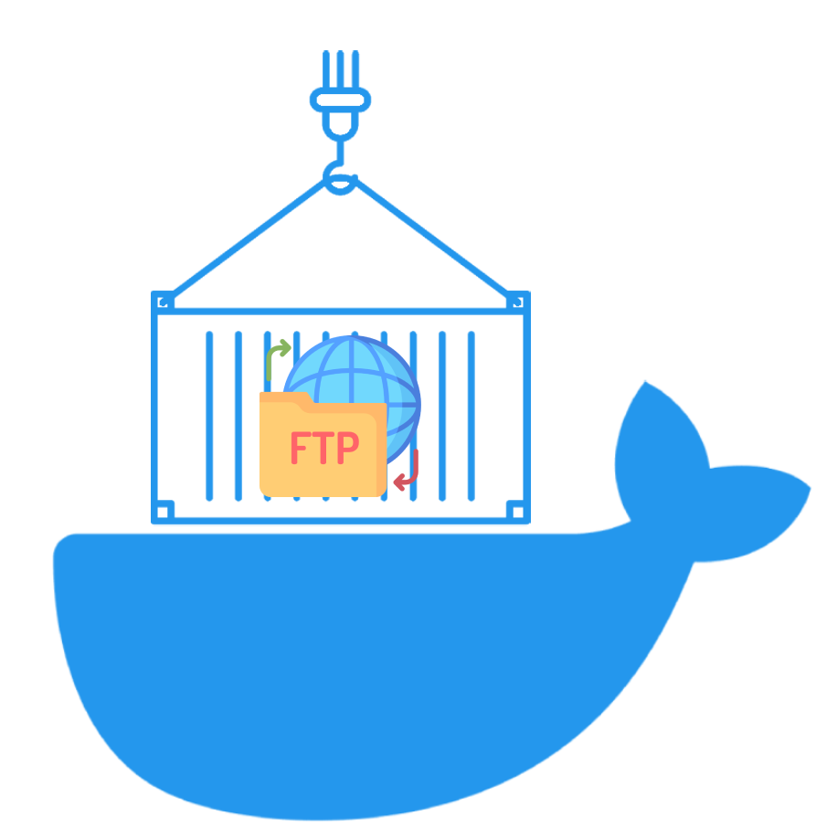

chrooted-ftp
====
[](https://github.com/timo-reymann/chrooted-ftp/releases)
[](https://hub.docker.com/r/timoreymann/chrooted-ftp)
[![Renovate](https://img.shields.io/badge/renovate-enabled-green?logo=data:image/svg+xml;base64,PHN2ZyB4bWxucz0iaHR0cDovL3d3dy53My5vcmcvMjAwMC9zdmciIHZpZXdCb3g9IjAgMCAzNjkgMzY5Ij48Y2lyY2xlIGN4PSIxODkuOSIgY3k9IjE5MC4yIiByPSIxODQuNSIgZmlsbD0iI2ZmZTQyZSIgdHJhbnNmb3JtPSJ0cmFuc2xhdGUoLTUgLTYpIi8+PHBhdGggZmlsbD0iIzhiYjViNSIgZD0iTTI1MSAyNTZsLTM4LTM4YTE3IDE3IDAgMDEwLTI0bDU2LTU2YzItMiAyLTYgMC03bC0yMC0yMWE1IDUgMCAwMC03IDBsLTEzIDEyLTktOCAxMy0xM2ExNyAxNyAwIDAxMjQgMGwyMSAyMWM3IDcgNyAxNyAwIDI0bC01NiA1N2E1IDUgMCAwMDAgN2wzOCAzOHoiLz48cGF0aCBmaWxsPSIjZDk1NjEyIiBkPSJNMzAwIDI4OGwtOCA4Yy00IDQtMTEgNC0xNiAwbC00Ni00NmMtNS01LTUtMTIgMC0xNmw4LThjNC00IDExLTQgMTUgMGw0NyA0N2M0IDQgNCAxMSAwIDE1eiIvPjxwYXRoIGZpbGw9IiMyNGJmYmUiIGQ9Ik04MSAxODVsMTgtMTggMTggMTgtMTggMTh6Ii8+PHBhdGggZmlsbD0iIzI1YzRjMyIgZD0iTTIyMCAxMDBsMjMgMjNjNCA0IDQgMTEgMCAxNkwxNDIgMjQwYy00IDQtMTEgNC0xNSAwbC0yNC0yNGMtNC00LTQtMTEgMC0xNWwxMDEtMTAxYzUtNSAxMi01IDE2IDB6Ii8+PHBhdGggZmlsbD0iIzFkZGVkZCIgZD0iTTk5IDE2N2wxOC0xOCAxOCAxOC0xOCAxOHoiLz48cGF0aCBmaWxsPSIjMDBhZmIzIiBkPSJNMjMwIDExMGwxMyAxM2M0IDQgNCAxMSAwIDE2TDE0MiAyNDBjLTQgNC0xMSA0LTE1IDBsLTEzLTEzYzQgNCAxMSA0IDE1IDBsMTAxLTEwMWM1LTUgNS0xMSAwLTE2eiIvPjxwYXRoIGZpbGw9IiMyNGJmYmUiIGQ9Ik0xMTYgMTQ5bDE4LTE4IDE4IDE4LTE4IDE4eiIvPjxwYXRoIGZpbGw9IiMxZGRlZGQiIGQ9Ik0xMzQgMTMxbDE4LTE4IDE4IDE4LTE4IDE4eiIvPjxwYXRoIGZpbGw9IiMxYmNmY2UiIGQ9Ik0xNTIgMTEzbDE4LTE4IDE4IDE4LTE4IDE4eiIvPjxwYXRoIGZpbGw9IiMyNGJmYmUiIGQ9Ik0xNzAgOTVsMTgtMTggMTggMTgtMTggMTh6Ii8+PHBhdGggZmlsbD0iIzFiY2ZjZSIgZD0iTTYzIDE2N2wxOC0xOCAxOCAxOC0xOCAxOHpNOTggMTMxbDE4LTE4IDE4IDE4LTE4IDE4eiIvPjxwYXRoIGZpbGw9IiMzNGVkZWIiIGQ9Ik0xMzQgOTVsMTgtMTggMTggMTgtMTggMTh6Ii8+PHBhdGggZmlsbD0iIzFiY2ZjZSIgZD0iTTE1MyA3OGwxOC0xOCAxOCAxOC0xOCAxOHoiLz48cGF0aCBmaWxsPSIjMzRlZGViIiBkPSJNODAgMTEzbDE4LTE3IDE4IDE3LTE4IDE4ek0xMzUgNjBsMTgtMTggMTggMTgtMTggMTh6Ii8+PHBhdGggZmlsbD0iIzk4ZWRlYiIgZD0iTTI3IDEzMWwxOC0xOCAxOCAxOC0xOCAxOHoiLz48cGF0aCBmaWxsPSIjYjUzZTAyIiBkPSJNMjg1IDI1OGw3IDdjNCA0IDQgMTEgMCAxNWwtOCA4Yy00IDQtMTEgNC0xNiAwbC02LTdjNCA1IDExIDUgMTUgMGw4LTdjNC01IDQtMTIgMC0xNnoiLz48cGF0aCBmaWxsPSIjOThlZGViIiBkPSJNODEgNzhsMTgtMTggMTggMTgtMTggMTh6Ii8+PHBhdGggZmlsbD0iIzAwYTNhMiIgZD0iTTIzNSAxMTVsOCA4YzQgNCA0IDExIDAgMTZMMTQyIDI0MGMtNCA0LTExIDQtMTUgMGwtOS05YzUgNSAxMiA1IDE2IDBsMTAxLTEwMWM0LTQgNC0xMSAwLTE1eiIvPjxwYXRoIGZpbGw9IiMzOWQ5ZDgiIGQ9Ik0yMjggMTA4bC04LThjLTQtNS0xMS01LTE2IDBMMTAzIDIwMWMtNCA0LTQgMTEgMCAxNWw4IDhjLTQtNC00LTExIDAtMTVsMTAxLTEwMWM1LTQgMTItNCAxNiAweiIvPjxwYXRoIGZpbGw9IiNhMzM5MDQiIGQ9Ik0yOTEgMjY0bDggOGM0IDQgNCAxMSAwIDE2bC04IDdjLTQgNS0xMSA1LTE1IDBsLTktOGM1IDUgMTIgNSAxNiAwbDgtOGM0LTQgNC0xMSAwLTE1eiIvPjxwYXRoIGZpbGw9IiNlYjZlMmQiIGQ9Ik0yNjAgMjMzbC00LTRjLTYtNi0xNy02LTIzIDAtNyA3LTcgMTcgMCAyNGw0IDRjLTQtNS00LTExIDAtMTZsOC04YzQtNCAxMS00IDE1IDB6Ii8+PHBhdGggZmlsbD0iIzEzYWNiZCIgZD0iTTEzNCAyNDhjLTQgMC04LTItMTEtNWwtMjMtMjNhMTYgMTYgMCAwMTAtMjNMMjAxIDk2YTE2IDE2IDAgMDEyMiAwbDI0IDI0YzYgNiA2IDE2IDAgMjJMMTQ2IDI0M2MtMyAzLTcgNS0xMiA1em03OC0xNDdsLTQgMi0xMDEgMTAxYTYgNiAwIDAwMCA5bDIzIDIzYTYgNiAwIDAwOSAwbDEwMS0xMDFhNiA2IDAgMDAwLTlsLTI0LTIzLTQtMnoiLz48cGF0aCBmaWxsPSIjYmY0NDA0IiBkPSJNMjg0IDMwNGMtNCAwLTgtMS0xMS00bC00Ny00N2MtNi02LTYtMTYgMC0yMmw4LThjNi02IDE2LTYgMjIgMGw0NyA0NmM2IDcgNiAxNyAwIDIzbC04IDhjLTMgMy03IDQtMTEgNHptLTM5LTc2Yy0xIDAtMyAwLTQgMmwtOCA3Yy0yIDMtMiA3IDAgOWw0NyA0N2E2IDYgMCAwMDkgMGw3LThjMy0yIDMtNiAwLTlsLTQ2LTQ2Yy0yLTItMy0yLTUtMnoiLz48L3N2Zz4=)](https://renovatebot.com)

<p align="center">
	
    <br />
    A dead simple alpine-based docker container to allow users only access their own home directory.
</p>

## Features
- slim FTP server
- SFTP support
- support for passive mode
- every user is jailed into his own root directory

## Usage

### Prepare
1. Add user entry in form username:password into a file mounted under `/opt/chrooted-ftp/users`.
2. Mount the desired host volume under `/data/username`
3. Fire up the server.

### Usage with FTP
1. Expose port `21` (also see the sample docker-compose)
2. Your user can connect to the ftp server, only seeing their files

### Usage with SFTP
1. Expose port `2022` (also see the sample docker-compose)
2. If you want to keep the host keys across restarts make sure to mount `/opt/chrooted-ftp/ssh_hostkeys`
3. Your user can connect to the sftp server on port 2022, the root directory /data contains all files

### Sample docker-compose
```yaml
version: '3.2'
services:
  ftp:
    image: timoreymann/chrooted-ftp
    environment:
      - "BANNER=Welcome to my dockerized FTP!"
    # USER_FTP_POSTFIX determines the ftp directory inside user home directory and defaults to /data if not set
    # If NO_USER_FTP_POSTFIX is set, USER_FTP_POSTFIX is disabled and the user home directory is exposed over ftp
    # - USER_FTP_POSTFIX=/data
    # - NO_USER_FTP_POSTFIX=true

    # - PUBLIC_HOST=custom-host.domain.tld # optional and only used for passive ftp, defaults to localhost
    ports:
      # active ftp
      - "21:21"
      # passive ftp ports, may differ if you configured them differently
      - "10090-10100:10090-10100"

      # sftp
      - "2022:2022"
    volumes:
      # Sample mount for user foo
      - /var/www/html:/data/foo
      # Mount user list
      - ./ftp_users:/opt/chrooted-ftp/users
      # Make sure to keep host keys across restarts
      - ./ssh_host_keys:/opt/chrooted-ftp/ssh_hostkeys
```

### Configuration

#### Users

Users can be configured using the `/opt/chrooted-ftp/users` file.

The syntax is `username:password`, once per line.

There is also the default user `bob` with password `s3cr3tCand!`. This user is gone at the moment you mount the users
file.

If using files is not your thing you can also create users with env vars, see the list in [General settings](#general-settings) for more information.
Both can be used togehter, so you can use env vars and/or file-based user creation.

#### FTP

You can further configure the ftp server using the following environment variables:

| Variable            | Usage                                                       |
|:--------------------|:------------------------------------------------------------|
| PASSIVE_MIN_PORT    | Minimum used passive port                                   |
| PASSIVE_MAX_PORT    | Maximum used passive port                                   |
| PUBLIC_HOST         | Public host                                                 |
| UMASK               | customize the ftp umask (default 022 => chmod 777)          |
| USER_FTP_POSTFIX    | Override the path exposed over ftp, defaults to /data       |
| NO_USER_FTP_POSTFIX | Disable USER_FTP_POSTFIX, ftp access to user home directory |


#### SFTP

> For SFTP there is currently no further configuration possible and necessary.

#### General settings

| Variable           | Usage                                                                                                      |
|:-------------------|:-----------------------------------------------------------------------------------------------------------|
| BANNER             | Banner displayed at connect using SFTP or FTP                                                              |
| ACCOUNT_<username> | Set the value to the password to set for <username>, this will create a user to be used with SFTP and FTP. |

#### Ports

> You must take care of opening/mapping the ports via docker to match your docker configuration.

Default ports are:

| Port        | Protocol    |
|:------------|:------------|
| 21          | Active FTP  |
| 10090-10100 | Passive FTP |
| 2022        | SFTP        |

I recommend exposing them as they are to the host, but you can also change them on the host.

See [docker docs](https://docs.docker.com/config/containers/container-networking/#published-ports) for more information.

For example usage, see the docker-compose example file above.

## Motivation
The problem this container is solving is the following:
I want to provide ftp for some users, but i dont want to configure the chroot stuff and so on.
So this container is doing exactly that. You can mount `/data` as your volume the subfolders are per user.
So you can mount for example a website for a user under `/data/bob` and your host volume
is `/var/www/bobs.homepage.digital`. Its just that simple.


# Documentation

## Under the hood

Under the hood the image is based on alpine and vsftpd. So it size and resource usage is really low.

## Chroot(ing)

VSFTPD and SFTP work completely different when it comes to chroot.

VSFTPD works with the user homes out of the box while SFTP chroot requires the common start folder to be owned by root.

To make it work with both, the structure is like this:

```text
/data           | user root
    <user>      | Home folder, owned by root:root
        /data   | Data folder, owned by <user> - override with USER_FTP_POSTFIX (or disable with NO_USER_FTP_POSTFIX)
```

This structure allows FTP to acess the data directly, while via SFTP you need to prepend the path /data

## Contributing
I love your input! I want to make contributing to this project as easy and transparent as possible, whether it's:

- Reporting a bug
- Discussing the current state of the configuration
- Submitting a fix
- Proposing new features
- Becoming a maintainer

To get started please read the [Contribution Guidelines](./CONTRIBUTING.md).

## Development

### Requirements
- [Docker](https://docs.docker.com/get-docker/)

